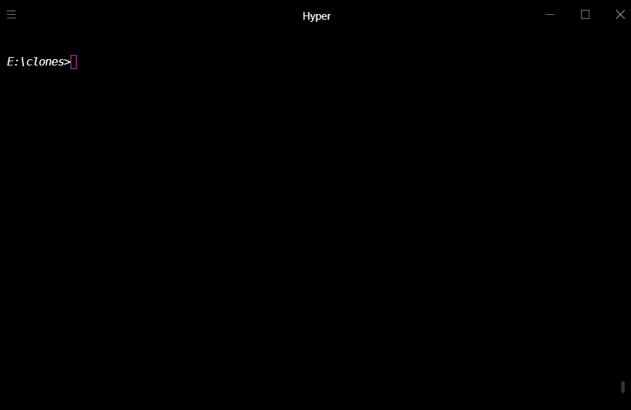

<br />
<p align="center">
  
  <h3 align="center"><i><strong>Termex</strong></i></h3>

  <p align="center">
    Explore the filesystem from your terminal
  <br />
<!--     <a href="https://github.com/pranavbaburaj/polyglot/blob/main/docs/README.md">📖 Documentation</a> -->
    ·
    <a href="https://github.com/pranavbaburaj/termex/issues">Report a Bug</a>
    ·
    <a href="https://github.com/pranavbaburaj/termex/pulls">Request Feature</a>
  </p>
  <br>
  <p align="center">
    
       
  </p>

  <br />

</p>



# About

Termex(**Ter**minal **Ex**plorer) is a terminal-based file explorer created using typescript. The project was originally created for the [Tech With Tim codejam](https://twtcodejam.net).

# Installation

## Manual installation

- **Windows**

Windows users can download the zip file from the [releases](https://github.com/pranavbaburaj/termex/releases/latest/). Unzip the downloaded file and you can find the termex executable in the directory. An alternate wa is to build from source. You can learn more about it [here](https://github.com/pranavbaburaj/termex#building-from-source)

## Building from source

Inorder to build the repository from your local system 💻, you will need to have the following programs installed:

- Node JS
- NPM
- Git

Once you have installed all the required software, let's get started by cloning the repository.

```sh
# Clone the repository into your local system
git clone https://github.com/pranavbaburaj/termex.git

# Get into the directory
cd termex
```
Open up the windows powershell in the termex directory and execute [`make.ps1`](https://github.com/pranavbaburaj/termex/blob/main/make.ps1).
